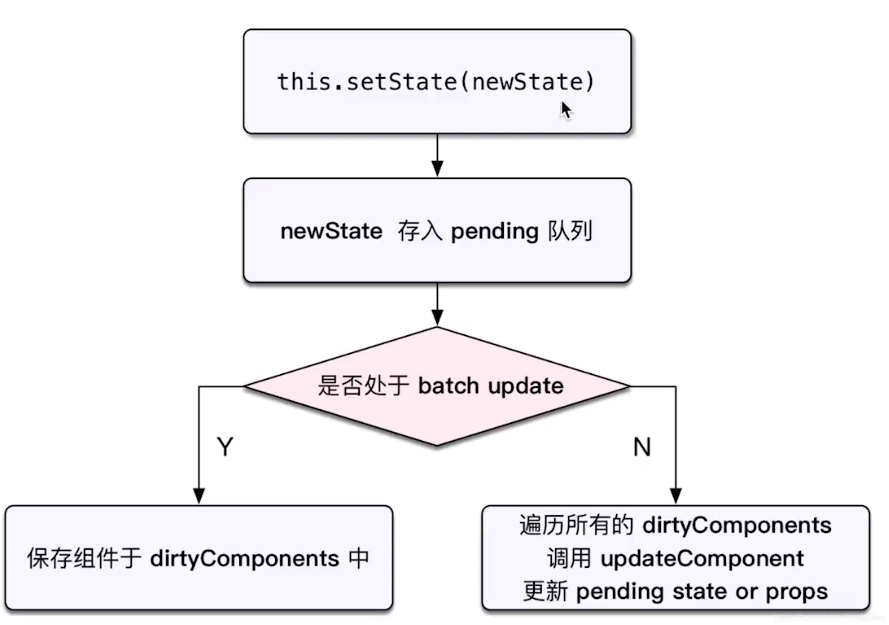

# React 原理
要点：
- 函数式编程
- vdom 和 diff
- JSX 本质
- 合成事件
- setState batchUpdate
- 组件渲染过程

## 函数式编程
- 一种编程范式，概念比较多
- 纯函数
- **不可变值**

> 这个概念很好理解，函数也是一等公民，这和其他数据类型一样，我们可以把它放在数组中，放在对象中，当作参数传递，赋值给变量等等。那么，函数式编程就意味着，我们可以用函数去拆解、抽象一般的表达式，最小‘可视’单位是函数的一种编码规范，重点体现‘函数式’。  
> 给予函数更清晰的语义化命名，将一系列对于基础数值的计算和操作放在函数中，并且由函数返回这个计算的结果，这个结果的由函数命名清晰的表达。
> 纯函数是函数式编程的一个概念。

## vdom 和 diff
- h 函数（React.createElement()）
- vnode 数据结构(React.createElement() 返回值，一半叫做 ReactElement)
- patch 函数
---
- 只比较同一级，不跨级比较
- tag 不相同，则直接删掉重建，不再深度比较
- tag 和 key，两者都相同，则认为是相同节点，不再深度比较
---
- Vue2 Vue3 React 三者实现 vdom 细节都不同
- 核心概念和实现思路，都一样

## JSX
- JSX 使用时的定位很像 Vue 模板
- Vue 模板不是 html
- JSX 也不是 JS，是 JS 的语法扩展  

JSX 会被自动转义成 JS 代码以及 React API。要重点关注`React.createElement()`这个方法，每当JSX有新的标签结构时，就会调用这个方法。  

```javascript
const imgElem = <div id="div1">
  <p>some text</p>
  
</div>

// babel 编译后
React.createElement("div", {id: "div1"}, React.createElement("p", null, "some text"), React.createElement("img", {src: imgUrl}))
```
上面可以看出来，`React.createElement()` 第一个参数是tag的名称，第二个是tag中的参数（例如：style, id, class, 事件 等等），第三个是子元素，子元素也可以这样嵌套（调用 createElement 创建）子元素（套娃就完事了）。  
> 但实际上 `createElement` 第一个参数不一定是 tag 名称，也可能是一个组件的变量名。子元素也可以是组件这样套下去。（从`createElement`第一个参数的首字母大小写，可以知道是 tag 还是组件）

摘录[掘金文章](https://juejin.im/post/5b9a45fc5188255c402af11f)的一段：我们写 React 组件的时候，通常会使用 JSX 来**描述组件**。`<p></p>`这种写法经过 **babel** 转换后，会变成以 `React.createElement(type, props, children)` 形式。而我们的例子中，`type` 会是两种类型：`function`、`string`。`function`一般是指`ReactComponent`的 `constructor` 或者函数式组件的 `function`，而 `string` 类型的就是 HTML 标签。  

更多可以参考 Babel 提供的在线示例，写入 JSX 之后 Babel 所编译的内容。[测试地址](https://www.babeljs.cn/)


## 合成事件
React 的事件：
- 所有事件挂载到 document 上
- event 不是原声的，是 SyntheticEvent 合成事件对象
- 和 Vue 事件不同，和 DOM 事件也不同  


### 为什么需要合成事件机制?
- 更好兼容性和跨平台
- 挂载到 document，减少内存消耗，避免频繁解绑
- 方便事件的统一管理（如事务机制）

## setState 和 batchUpdate
预先了解的 setState 概念：
- 有时异步（普通使用），有时同步（setTimeout、DOM 事件）
- 有时合并（对象形式），有时不合并（函数形式）  

核心知识点：
- setState 流程
- batchUpdate 机制
- transaction （事务）机制

### setState 流程
[解密 React setState —— IMWeb](https://imweb.io/topic/5b189d04d4c96b9b1b4c4ed6)  


图可见 “是否处于 batch update” 很重要。
> `dirtyComponents` 是一个组件列表（数组）

### 机制详解
React 在执行函数时，会由 React 对函数设置一个 `isBatchingUpdates`变量，函数执行开始时初始值为 `true`，函数执行完毕之后会被设置成`false`（所以setTimeout 中的 setState 是同步的。）

### 总结
- setState 无所谓异步还是同步
- 看是否能命中 batchUpdate 机制
- 判断 isBatchingUpdates （变量是ture还是false）

### 哪些能命中 batchUpdate 机制
- 生命周期（和它调用的函数）
- React 中注册的事件（和它调用的函数）
- React 可以“管理”的入口

### 不能被 batchUpdate 机制命中
- setTimeout setInterval 等（和它调用的函数）
- 自定义的 DOM 事件（和它调用的函数）
- React “管不到” 的入口

## transaction 事务机制
```javascript
class ListDemo extends React.Component {
  constructor(props) {
  }
  
  render() {
  }

  increase = () => {
    // 开始：处于 batchUpdate
    // isBatchingUpdates = true
    
    // 其他任何操作

    // 结束
    // isBatchingUpdates = false
  }
}
```
这个流程就是 transaction 事务机制  
具体流程图：  


## 组件渲染更新过程
重点：
- JSX 如何渲染为页面
- setState 之后如何更新页面
- 全流程

### JSX 本质和 vdom
- JSX 本质上就是 createELement
- 执行createElement 生成 vnode
- React 的 patch，诸如 patch(elem, vnode) 和 path(vnode, newVnode) 

### dirtyComponents
在 batch update 逻辑中，走 `true` 异步更新的组件会放到 dirtyComponents 中。

### 具体过程
- 组件渲染和更新过程
- 更新的两个阶段
- React fiber

#### 组件渲染过程
- props state
- render() 生成 vnode
- patch(elem, vnode) - react 这部分逻辑的执行函数不一定是patch，但是方式类似


#### 组件更新过程
- setState(newState) --> dirtyComponents （可能有自组件，不仅仅包含当前触发的组件）
- render() 生成 newVnode
- patch(vnode, newVnode)

## fiber
React 的 patch 分为两个阶段：
1. **reconciliation** 阶段 - 执行 diff 算法，纯 JS 计算
2. **commit** 阶段 - 将 diff 结果渲染 DOM
### 为什么要分阶段
- JS 是单线程，并且 JS 和 DOM 渲染共用一个线程
- 当组件足够复杂，组件更新时计算和渲染的压力也会变大
- 同时再有 DOM 操作需求（动画，鼠标拖拽等），将卡顿

### React 的解决方案 fiber
- 将 reconciliation 阶段进行任务拆分（commit 无法拆分）
- DOM 需要渲染时暂停计算，空闲时恢复计算
- window.requestIdleCallback 用于判断什么时候暂停