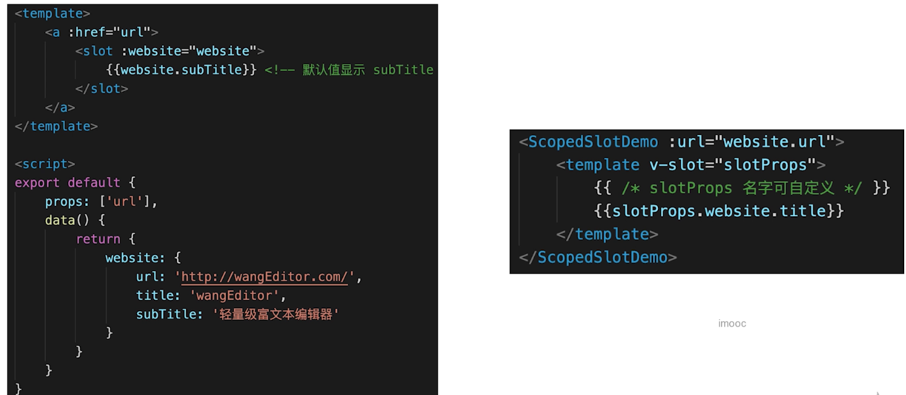
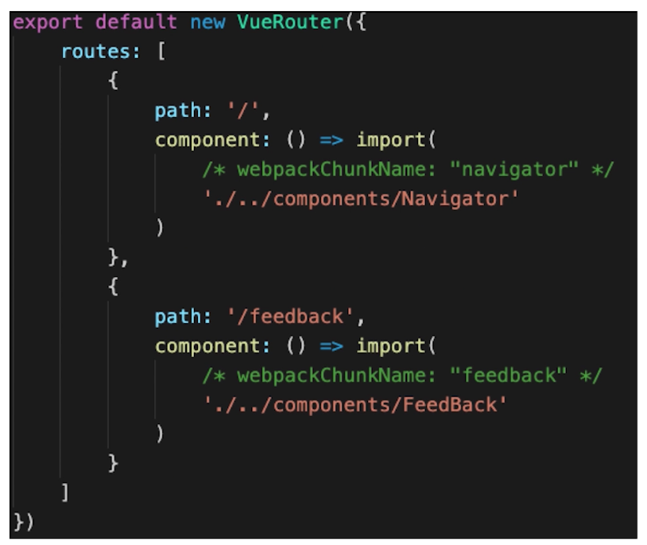

## 一些常见面试题
### v-show 和 v-if 的区别
- v-show 通过 CSS display 控制显示和隐藏
- v-if 组件真正的渲染和销毁，而不是显示和隐藏
- 频繁切换显示状态用 v-show，否则用 v-if
### 为什么要在 v-for 中使用 key
- 必须用 key，且不能是 index 和 random（不建议使用，为了避免出现一些问题）
- diff 算法中通过 tag 和 key 来判断，是否是 sameNode
- 减少渲染次数，提升渲染性能
### 描述 Vue 组件声明周期（父子组件）
- 单组件生命周期图
- 父子组件生命周期关系（生命周期之间的交叉）
### vue 组件如何通讯（常见的讯通方式）
- 父子组件 props 和 this.$emit
- 自定义事件 event.$on  event.$off  event.$emit
- vuex
### 描述组件渲染和更新的过程
还是那张图，在原理笔记中好好记住

### 双向数据绑定 v-model 的实现原理
- input 元素的 value  = this.name
- 绑定 input 事件 this.name = $event.target.value
- data 更新触发 re-render
### 对 MVVM 的理解

### computed 有何特点
- 缓存，data 不变不会重新计算（计算属性是基于它们的依赖进行缓存的。计算属性只有在它的相关依赖发生改变时才会重新求值）
- 提高性能
> computed 通过 watcher.dirty 控制是否读取缓存。computed 会让【data依赖】收集到【依赖computed的watcher】，从而 data 变化时，会同时通知 computed 和 依赖 computed 的地方。
### 为何组件 data 必须是一个函数
data 如果不是函数会影响别的组件，是函数的话，这个组件的data函数就在一个闭包种，作用域不会共享
### ajax 请求应该放在哪个生命周期
- mounted
- JS 是单线程，ajax 异步获取数据
- SSR 例外，服务端渲染会有单独的生命周期函数，例如 nextjs 的 [getInitialProps](https://nextjs.org/docs/api-reference/data-fetching/getInitialProps),nuxtjs 的 [asyncData](https://zh.nuxtjs.org/guide/async-data#asyncdata-%E6%96%B9%E6%B3%95)

### 如何将组件所有 props 传递给子组件？
$props
```javascript
<User v-bind="$props" />
```
### 如何自己实现 v-model
```vue
<template>
  <input
    type="text"
    :value="text"
    @input="$emit('change', $event.target.value)"
  >
  <!-- 
    注意
    第一，上面使用 :value 而没用 v-model
    第二，上面的 change 和 model.event 对应起来即可，名字自己改
  -->
</template>
<script>
export default {
  model: {
    prop: 'text', // 对应到 props text
    event: 'change'
  },
  props: {
    text: String
  }
}
</script>
```
### 多个组件有相同的逻辑，如何抽离
- mixin (但是 mixin 有缺点)
### 什么时候用异步组件？
- 加载大组件
- 切换路由异步加载
### 什么时候需要使用 keep-alive?
- 缓存组件，不需要重复渲染
- 如多个静态 tab 页的切换（不需要重新渲染离开的tab，切换回来还是原来的数据）
- 优化性能（使用 keep-alive 的本质）

### 什么时候需要使用 beforeDestory
- 解绑自定义事件 event.$off
- 清除定时器
- 解绑自定义的 DOM，如 window scroll 等
> 如果不及时清除，都有可能造成内存泄露
### 什么是作用域插槽
将slot组件自身的data传递给使用slot的地方

### vuex 中 action 和 mutation 有何区别
- action 中处理异步，mutation 不可以
- mutation 做原子操作（只做一个操作）
- action 可以整合多个 mutation （整合成多个原子的集合）
### 如何配置 vue-router 异步加载

### 请用 vnode 描述一个 DOM结构
在没有明确要求哪种 vnode 的情况下只要做到明确描述出一个DOM结构，对象结构清晰即可。

### 简述 diff 算法过程
- patch(elem, vnode) 和 patch(vnode, newVnode)
- patchVnode 和 addVnodes 和 removeVnodes
- updateChildren （key 的重要性）
### Vue 为何是异步渲染，$nextTick 何用？
- 异步渲染（以及合并 data 修改），以提高渲染性能
- $nextTick 在 DOM 更新完之后，触发回调
### Vue 常见性能优化方式
- 合理使用 v-show 和 v-if
- 合理使用 computed
- v-for 时加 key，以及避免和 v-if 同时使用
- 自定义事件、DOM 事件及时销毁
- 合理使用异步组件
- 合理使用 keep-alive
- data 层级不要太深（会导致递归次数过多）
- 使用 vue-loader 在开发环境做模板编译（预编译）
- webpack 层面的优化（通用优化）
- 图片懒加载（通用优化）
- 使用 SSR