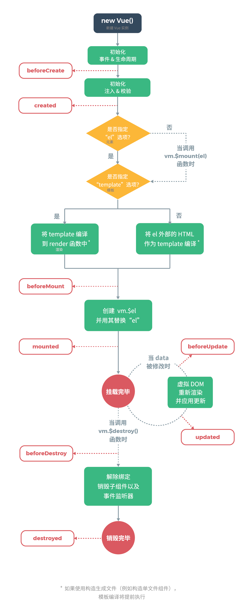
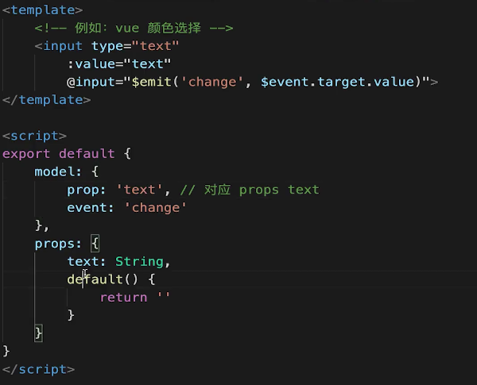

# Vue 使用
## 考点
- 基本使用，组建使用 —— 常用、必须会
- 高级特性 —— 不常用，但体现深度
- Vuex 和 Vue-router 使用（日常开发基本必用）

### 面试题
- `v-show` 和 `v-if` 的区别
- 为何 `v-for` 中要用 `key`
- 描述 Vue 组件生命周期（有父子组件的情况）
- Vue 组件如何通讯
- 描述组件渲染和更新的过程
- 双向数据绑定 v-model 的实现原理

## Vue 基础使用


### 指令、插值
- 插值、表达式
- 指令、动态属性
- v-html: 会有 XSS 风险，会覆盖子组件

### computed 和 watch
- computed 有缓存，data 不变则不会重新计算
- watch 如何深度监听？(默认不是深度监听)
- watch 监听引用类型，拿不到 oldVal  
实现深度监听：

上方 `watch` 监听的属性`name`就是一个浅层的监听，而`info`是个引用类型，我们需要深度监听。  
值类型，可正常拿到 oldVal 和 val  
引用类型，拿不到 oldVal。监听时：val 和 oldVal 指向同一个堆。因为指针相同，此时已经指向了新的 val

### class 和 style
- 使用动态属性
- 使用驼峰式写法  
动态属性使用：
```javascript
<p :class="{black: isBlack, yellow: isYellow}" >使用 class</p>
<p :class="[black, yellow]" >使用 class</p>
<p :style="styleData" >使用 style</p>


// 这里的 styleData 在组件中应该这样声明使用
data() {
  return {
    // 带 - 分隔符的css属性自动转换成驼峰式写法
    styleData: {
      fontSize: '40px',
      color: 'red',
      backgroundColor: '#ccc'
    }
  }
}
```

### 条件渲染
- `v-if` `v-else` 的用法，可使用变量（boolean），也可以使用 `===` 表达式
- `v-if` 和 `v-show` 的区别？（v-if 关系 DOM 渲染和 v-show 关系隐藏 `display: none`）
- `v-if` 和 `v-show` 的应用场景（更频繁的场景使用 v-show，一次性条件判断使用 v-if）

### 列表渲染
- 如何遍历对象？—— 也可以用 `v-for`
- key 的重要性。key 不能乱写（不建议如 random 或者 index，最好 key 能具有业务相关的信息）
- `v-for` 和 `v-if` 不能（不建议）一起（放在同一个标签中）使用！

### 事件
- event 参数，自定义参数
- 事件修饰符，按键修饰符
- 【观察】事件被绑定到哪里？
这里的`event`指的是内联语句处理器中访问原始的DOM事件的特殊变量：
```JavaScript
<button v-on:click="warn('Form cannot be submitted yet.', $event)">
  Submit
</button>

// ...
methods: {
  warn: function (message, event) {
    // 现在我们可以访问原生事件对象
    if (event) {
      event.preventDefault()
      // 1. event 是原生的
      // 2. 事件被挂载到当前元素
    }
    alert(message)
  }
}
```

### 表单 [详情](https://cn.vuejs.org/v2/guide/forms.html)
- v-model（使用这个在表单元素上创双向数据绑定）
- 常见表单项 textarea checkbox radio select
- （v-model的）修饰符 lazy number trim

## Vue 组件使用
- props 和 $emit（父组件通过`props`向子组件传递信息，子组通过`$emit`向父组件触发事件）
- 组件间通讯 - 自定义事件 （Vue 本身具有自定义事件的能力，用来实现同级组件，没有关系的组件之间的通信，除了Vuex的其他方案）
- 组件声明周期（基本必须考）  
声明周期相关：在开发过程中经常会碰到在`mounted`或者`created`生命周期中（使用 `$on`）监听（子组件`$emit`分发的）自定义事件，在`beforeDestroy`中（使用`$off`）销毁事件，以防可能出现的内存泄漏。  
> 注意`this.$emit`和`event.$emit`是不同的，前者是嗲用父组件的事件，后者是调用自定义事件

### 组件[生命周期](https://cn.vuejs.org/v2/guide/instance.html)（单个组件）
几个阶段：
- 挂载阶段
- 更新阶段
- 销毁阶段  
阶段名词和这张图要好好记住：  
  
#### 挂载阶段：
组件的初始化（created）是从外（父组件）到内（子组件）的，渲染（mounted）的优先级是从内（子组件）到外（父组件）的
#### 更新阶段
组件的更新顺序和挂载阶段类似，从外层触发（beforeUpdate），然后触发内层，内层更新（updated）完毕，外层更新

## Vue 高级特性
考点:
- 不常用，但要知道
- 掌握全面且深度
- 考察项目是否有深度和复杂度（用到了高级特性）  
高级特性:
- 自定义 v-model
- $nextTick refs
- slot
- 动态、异步组件
- keep-alive
- mixin

### 自定义 v-model
为了实现双向数据绑定：  
  
1. 上面的 `input` 使用了 `:value` 而不是 `v-model`
2. 上面的 `change` 和 `model.event`要对应起来
3. text 属性对应起来

## $nextTick 和 refs
- Vue 是异步渲染
- data 改变之后，DOM 不会立即渲染
- $nextTick 会在 DOM 渲染之后被触发，以获取最新 DOM 节点  
在一个元素标签中写了`ref`属性，类似这样`<ul ref="ul1"></ul>`，这样定义之后可以像`const ulElem = this.$refs.ul1`来获取 DOM 元素，这是在 Vue 中获取 DOM 节点的常用方式。因为异步的关系，data 改变之后，DOM 不会立即渲染，如果执行`ulElem.childNodes.length`不会立即识别新增的 DOM。想要立即得到更新的data对DOM节点的影响，则使用 $nextTick：
```javascript
// 1. 因为data改变之后是异步渲染，而$nextTick 会等待 DOM 渲染完再回调
// 2. 页面渲染时会将 data 的修改做整合，（一次事件触发）多次 data 修改只会渲染一次
this.$nextTick(() => {
  const ulElem = this.$refs.ul1
  console.log(ulElem.childNodes.length)
})
```