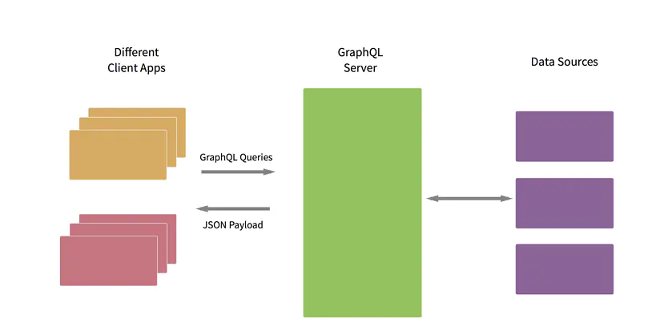
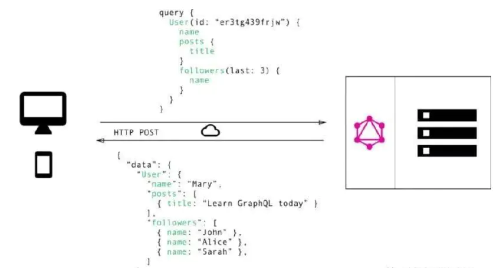

# 基于 NodeJS 构建 GraphAPI
笔记内容来源：[掘金小册 - 基于 NodeJS 构建 GraphQL API 服务](https://juejin.im/book/5e588e04518825492b50b274)
## 概念
API 服务器 要考虑的两个方面：
1. 风格 - 常用 RPC 风格和 REST 风格
2. 媒体风格 - 常用 JSON，XML，Protobuf  
  
[GraphQL](https://graphql.org/) 来自 Facebook：GraphQL 支持声明数据获取，客户端可以在其中准确的指定需要从 API 获概念。[在线尝试 TypeScript](https://www.typescriptlang.org/play?#code/GYVwdgxgLglg9mABAcwE4FN1XagFABxwGcEAuRIqVGMZASkQG8AoRNxDKEVJAAwAt0AGyFxEAdziohAEwCEiACSNCqEmAC+vZhqA)

与返回固定数据结构的多个端点（multiple endpoints）不同，GraphQL服务器只公开**单个端点**（a single endpoint），并使用**客户机请求的准确数据**进行响应。

### GraphQL 对比 REST
  
REST 是一个概念，不存在规范。GraphQL 具有规范草案，并且本身是一个**查询语言**而不是一种体系结构

### 单个端点
GraphQL 只有一个端点，在这一个端点上发送所有请求(不再使用 HTTP 动词来确定请求类型)。  
REST 有多个端点，使用 HTTP 动词来区分 读操作(get)，写操作(POST, PUT, DELETE)。


### 根据需求定制
REST 客户端**无法控制请求得到的数据**（除非使用稀疏字段集来进行查询`?a=xxx&b=xxxx`这样或者POST请求来根据服务器约定来请求数据），一般来说都会获取到比自己需要更多的信息，而开发中这些信息是用不到的，但是为了节约类似接口，相似的开发需求只能允许多余数据的存在。  
GraphQL 可以明确地请求想要的信息，这会节省一定的服务器资源。
  

### GraphQL 可以监控字段的使用情况

### 类型
REST API基于JSON，无法提供类型控制。**GraphQL 有一个[Type System](https://graphql.org/learn/schema/#type-system)**。

### 谁更好
还是按照需求选择自己的 API 风格。

## TypeScript
JS 的超集，一个更加严谨的 JavaScript？带来了诸多好处：

- 静态类型、类、模块、接口和类型注解
- 代码的可读性和可维护性
- IDE 的支持（报错处理，避免bug）
- 完全的面向对象
- 可以在编译阶段就发现大部分错误
- 重构相比 JavaScript 要简单很多

> 在 TypeScript 中你可以使用 JavaScript 的所有代码概念。

使用[在线 TypeScript](https://www.typescriptlang.org/play?#code/GYVwdgxgLglg9mABAcwE4FN1XagFABxwGcEAuRIqVGMZASkQG8AoRNxDKEVJAAwAt0AGyFxEAdziohAEwCEiACSNCqEmAC+vZhqA)
直接写一个简单的函数感受差异：

有个`(parameter) person: any`错误，那么已经提示了应该改成这样：
```typescript
function greeter(person: string) {
    return `hello world! ${person}`
}
```
> 注意，这和在参数前面声明类型不同，而是`person: any`这个`any`代表任意类型（也就是`any`这个类型，不确定的参数或者值的类型的情况下也需要声明这个类型）。这点在平时开发中很重要，比如在一般开发中，在没有类型的约束下会发生很多诸如类型自动转换之类的错误，在没有执行一定处理的情况下，这样不合格的参数会造成很多意想不到的事情甚至是安全问题（例如之前做的加拿大留学移民打分系统时的一系列计算数据，预期的数据一定要做好判断和处理，而在没有注释的情况下，不会知道函数到底需要什么样的参数）


### 严格模式的规则
**TypeScript 默认开启严格模式**  
规则：  


### 数据类型
和普通的JavaScript有一定的差异  


## 元组 Tuple
```typescript
// 声明一个元组类型
const info: [string, number] = ['Jack', 20]; // OK

// 如果你的数组没有满足元组要求 
const info: [string, number] = [20, 'Jack']; // Error
// Type 'number' is not assignable to type 'string'.
// 这个错误是因为不能将数字类型分配给字符串类型

const info: [string, number] = ['Jack']; // Error
// Property '1' is missing in type '[string]' but required in type '[string, number]'.
// 这个错误大概意思就是缺少一个属性，但在元组中设定是必须的
```
上面第一示例会打印：`['Jack', 20]`，并且是严格遵循等号左边的`[string, number]`的数据类型，不然都会报错，顺序不可以颠倒，长度不可以违规，是固定的（几个类型声明对应几个合法数据）。

## 枚举
enum类型是对 JavaScript 标准数据类型的一个补充。 像 C# 等其它语言一样，使用枚举类型可以为一组数值赋予友好的名字。

### 数字枚举
```typescript
enum Direction {
	Top,   // 我们可以初始化，比如 Top = 1
    Bottom,
    Left,
    Right
}
```
> 默认情况下数字枚举是从0开始自增长，也可以通过初始化来指定成员的数值。

### 字符串枚举
```typescript
enum Direction {
  Top = "Top",
  Bottom = "Bottom",
  Left = "Left",
  Right = "Right"
}
```
每个成员都必须使用字符串字变量，并且字符串没有自增长的行为，字符串枚举可以很好的序列化（相比数字枚举可读性更高）。

### Any
表示任意类型的值。无法确定值具体的类型时使用。使用这个类型定义能在不确定类型的情况下通过类型检查。但是**不要滥用**（都是不确定的值那么本身也就失去了使用 TypeScript 的意义）！
#### 规则
1. any 类型的变量可以被赋值任何类型数据
2. any 类型的数据可以赋值给除 never 外的任何数据类型变量
3. 如果是 any 类型，那么可以访问它的任意属性（即便不存在）
4. any 类型对象任意属性值都是 any 类型
5. any 类型数据可以当做函数或者构造函数调用，可以有任意参数
6. 如果没有明确给出数据类型，并且编译器无法推断，那么将被规定为 any 类型

### Void
如果方法没有返回值，那么这个方法的**返回值类型**就是 Void 类型。
```typescript
function test() : void {
	console.log('Hello Void');
}
```
#### 反过来说
当函数具有返回值那么就需要规定返回值所返回的类型：
```typescript
function test() : number {
  return 123
}
```


### Never
示的是那些**永不存在的值**的类型，使用场景主要是那些抛出异常或根本不会有返回值的函数表达式或箭头函数表达式的返回值类型。
```typescript
// 返回never的函数必须存在无法达到的终点
function error(message: string): never {
    throw new Error(message);
}

// 推断的返回值类型为never
function fail() {
    return error("Something failed");
}

// 返回never的函数必须存在无法达到的终点
function infiniteLoop(): never {
    while (true) {
    }
}
```

## 类型断言
通过类型断言这种方式可以告诉编译器，“相信我，我知道自己在干什么”。 类型断言好比其它语言里的 类型转换，但是不进行特殊的数据检查和解构。 它没有运行时的影响，只是在编译阶段起作用。 TypeScript会假设你，程序员，已经进行了必须的检查。
### 尖括号语法
```javascript
function info(name : string, age : string | number) {
    if ((<string>age).length) {				//断言
        console.log((<string>age).length)	//断言
    }  else {
        console.log(age.toString)
    }
}
```
### as 语法（在 TS 使用 JSX 中只允许这种语法）
```typescript
function info(name : string, age : string | number) {
    if ((age as string).length) {				//断言
        console.log((age as string).length)		//断言
    }  else {
        console.log(age.toString)
    }
}
```
> 这里注意一个细节，如果一个值可以是具体的几种类型，那么可以像代码 `age: string | number` 这样声明。  
> 两种（`as`和`<>`）语法是等价的。但是！在 TypeScript 中使用 JSX ，只有 as 语法是被允许的。

## 语法特性
了解基本概念之后用起TypeScript可以像写传统面向对象语言一样写代码，并且可以具有面向对象的一些特性。
```typescript
// 接口
interface YourInfo {
    name: string
    hobby: Array<string>
}
// 类
class Yon{
  // 构造方法
  constructor(information: YourInfo) {
    
  }
  public name: string = "YonDee"
  public age: number = 18
  public hobby: Array<string> = ['编程', '游戏', '音乐', '撸猫']

  public sayHi() : string {
    return "Hi!"
  }

  public getHobby() : Array<string> {
    return this.hobby
  }

  // 秘密
  private secret() {}
}

// use
// 自报家门并且打招呼
const yondee = new Yon({
  name: "zhangsan",
  hobby: ['看书', '旅游']
})

console.log(yondee.sayHi()) // 认识并打招呼

// 还可以认识我的朋友
class FriendA extends Yon{
  name = 'lisi'
  hobby = ['睡觉']
}

const lisi = new FriendA({
  name: "zhangsan",
  hobby: ['看书', '旅游']
})

console.log(lisi.sayHi())
```

#### 修饰符
TypeScript 里面定义属性的时候给我们提供了 三种修饰符：

- public : 在 TypeScript 的类中，成员都默认为 public, 被此限定符修饰的成员是可以被外部访问。
- protected： 当成员被设置为 protected 之后, 被此限定符修饰的成员是只可以被类的内部以及类的子类访问。
- private ： 当成员被设置为 private 之后, 被此限定符修饰的成员是只可以被类的内部访问（这个类本身）。

> 啊，这就是当初写 PHP 那种感觉不是嘛 (狗头

#### 封装
把客观的事物封装成抽象的类，并且类可以把自己的数据和方法只让可信的类或者对象操作，对不可信的类进行信息的隐藏。简单的说就是：封装使对象的设计者与对象的使用者分开，使用者只要知道对象可以做什么就可以了，不需要知道具体是怎么实现的。封装可以有助于提高类和系统的安全性。

#### 继承
继承指的是建立一个新的派生类，从先前定义的类中继承数据和函数，可以重新定义或加进新数据和函数，从而建立了类的层次或等级。

> 注意：我们无法继承私有（private）的属性或方法

#### 多态
多态性指的是： 同一操作作用与不同类的实例，将产生不同的执行结果，即不同类的对象收到相同的消息时，将得到不同的结果。

#### 接口 Interface
**利用接口约束了传入变量的内容**，注意，在赋值时：变量的形状（形式）必须和接口的形状（形式）保持一致。  
  
在面向对象的编程中，接口是一种规范的定义，它定义了行为和动作规范，在程序设计里面，**接口起到了一种限制和规范的作用**。  
  
接口定义了某一批类所需要遵守的规范，接口不关心这些类的内部状态数据，也不关心这些类里面方法的实现细节，它只规定这批类里面必须提供某些方法，提供这些方法的类就可以满足实际需要（比如接口需求的内容会被类的后续函数进行处理）